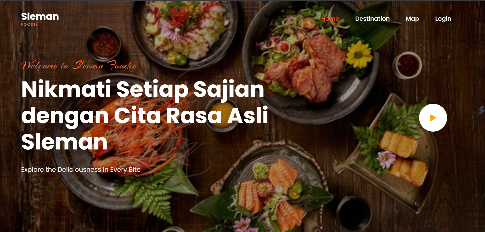
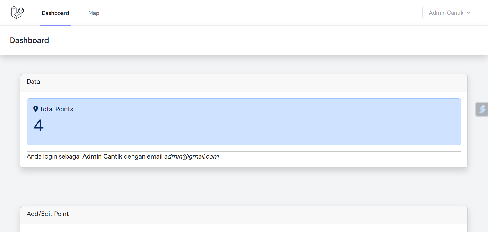
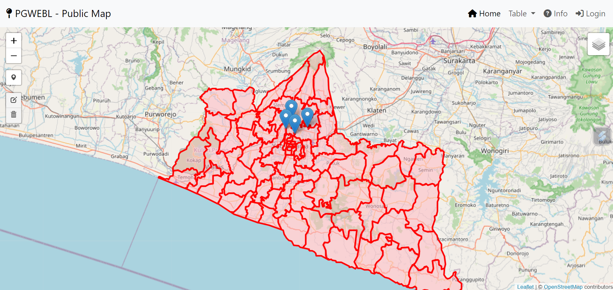

Sleman Foodie 

## Sleman Foodie
Sleman Foodie merupakan sebuah platform WebGIS Kuliner yang ada di area kajian Sleman Yogyakarta yang dapat digunakan sebagai inspirasi kuliner bagi wisatawan 

## Komponen Pembangun
Beberapa komponen yang ditampilkan diambil dari database DBeaver, Library LeafletJS, Bootstrap, File GeoJSON, dan Plugin pada muka Peta

## Manfaat dan Tujuan
1. Sebagai informasi kuliner berbasis Sistem Informasi bagi wisatawan kuliner Sleman Yogyakarta.
2. Peningkatan Layanan Informasi kuliner bagi Dinas Pariwisata Sleman Yogyakarta.
3. Sebagai Pengembangan Berkelanjutan

## Sumber Data
1. Shapefile Administrasi Sleman Yogyakarta
2. Titik Wisata Kuliner Sleman Yogyakarta
3. Foto Wisata Kuliner Sleman Yogyakarta

### Link Project
https://github.com/Rindi1414/Responsi-PGWEBL

### Tangkapan Layar

### Hak Cipta
Rindi Tri Setyaningsih

